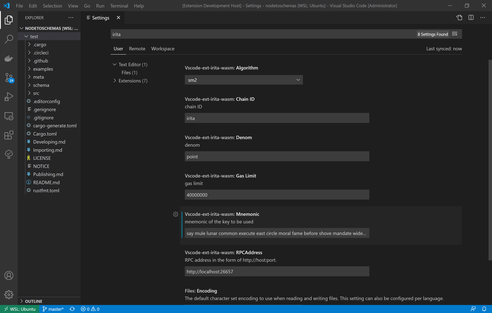

# vscode-ext-irita-wasm
Visual Studio Code Extension for IRITA WASM

 

This extension has been designed to help you in generating template of cosmwasm smart contract, compiling and deploying smart contracts of cosmwasm to IRITA.

## Features

### Generate

- Generate template of the cosmwasm smart contracts

### Compile

- Compile the cosmwasm smart contracts

### Deploy

- Deploy the cosmwasm smart contract to IRITA

## Requirements
- [VSCode version 1.52 or greater](https://code.visualstudio.com)
- [Node v10.x or greater](https://nodejs.org/en/download/)
- [Rust version 1.48.0 or greater](https://www.rust-lang.org/tools/install)
- [Git version 2.25.1 or greater](https://git-scm.com/downloads/)

## Release Notes

See [CHANGELOG.md](CHANGELOG.md)

## Extension Settings

This extension contributes the following settings:

- `Algorithm`: algorithm
- `ChainID`: chain ID
- `Denom`: denom
- `GasLimit`: gas limit
- `RpcAddress`: RPC address in the form of http://host:port.
- `Mnemonic`: mnemonic of the key to be used

- NOTE!: At present, only mnemonic is supported to import key!

These settings can be changed in standard VSCode settings accessible using the Gear box icon in lower left corner.

### How to use this extension?

Press Ctrl+Shift+X or Cmd+Shift+X to open the Extensions panel. Find and install the VSCode Extension for vscode-ext-irita-wamsm. 
You can also install the extension from the Marketplace. 

The extension provides the following functionalities which facilitate the whole smart contracts development process.

- `Generate`
- `Compile`
- `Deploy`

#### Generate

Right click anywhere in the resource manager, and choose 'vscode-ext-irita-wasm: Generate contract template' to generate a template.

#### Compile

if you want to compile a cosmwasm smart contract, right click the directory of the project or any file in the directory, choose 'vscode-ext-irita-wasm: Compile the project' to compile smart contract.The compiled file is in the `target` folder under the project

#### Deploy

To deploy a smart contract, right click the .wasm file and choose 'vscode-ext-irita-wasm: Deploy contract on IRITA'; or open .wasm file, press Ctrl+Shift+P or Cmd+Shift+P and enter 'deploy' to deploy contract.

## License

This project is licensed under the LGPL License - see the [LICENSE.md](LICENSE) file for details.
